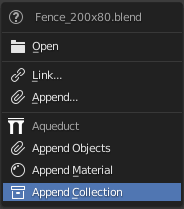

**************************
Drag and Drop Context Menu
**************************

Aqueduct features an extended blendfile drag and drop context menu. When you
drag and drop a .blend-file onto the blender window, the context menu that
pops up will have three additional entries. Currently only appending of 
Materials, Objects and Collections is supported, we are working on giving
you the ability to link assets the exact same easy way.

Append Objects
==============
If you choose **Append Objects** and the drag and dropped file contains more
than one singular object a floating gui window will open. The floater displays
a list of all objects the dropped file contains and you can tick the checkboxes
on the left to specify which objects you want to append.

The appended objects will position themselves around blenders 3D Cursor.

Append Material
===============
If you choose **Append Material** and the drag and dropped file contains more
than one singular material a floating gui window will open. The floater displays
a list of all materials in the dropped file and you can tick the checkboxes on
the left to specify which materials you want to append.
If you choose only a single material or the blendfile only contains a singular
material aqueduct will import it and instantly drop you into the **Material Quickapply
Operator**.

Append Collection
=================
If you choose **Append Collection** and the drag and dropped file contains more
than one singular collection a floating gui window will open. The floater displays
a list of all collections in the dropped file and you can tick the checkboxes
on the left to specify which collections you want to append.

The appended objects will position themselves around blenders 3D Cursor.
