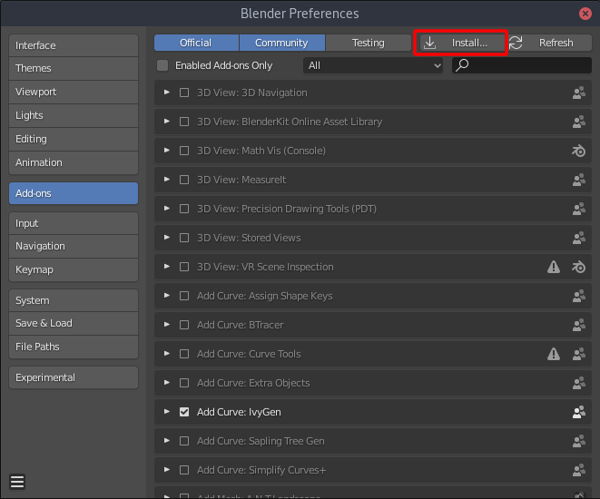
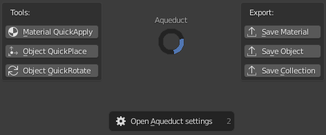
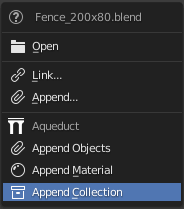

Getting Started
===============

Installation
############

After downloading the latest version of Aqueduct from blendermarket.com:

#. Open **Blender**
#. Open the **Blender Preferences** via **Edit > Preferences** or **F4 > Preferences**
#. Click on **Add-ons** on the left and choose **Install...** (as shown in the image below)
#. Navigate through your filesystem and select **aqueduct_x.x.zip**

Where to find it
################
After activating the Aqueduct addon you can open it's Pie Menu by pressing
**Hotkey: Ctrl + Shift + A**. The Pie menu contains multiple tools to improve
your workflow. Some Object placement and Material distribution tools and 
operators to save Materials, Objects and Collections to their own files.
A detailed explanation of all the operators can be found on the xxx page.

When you drag and drop a blend file onto the Blender window after activating Aqueduct
you will notice that the context menu that appears is now different and features additional
options.

Updating the addon
##################

Updating the addon can be done one of two ways:

Installing over the previous version
    Going through the `Installation`_ process again and selecting the newer version zipfile.

    If you are doing it this way you still need to disable and reenable the addon by 
    unchecking and checking it in the Preferences to make sure the updated version is loaded.
   
Removing & installing
    Removing the addon with the Remove button in it's Preferences section and then installing the newer version zipfile as described in `Installation`_
