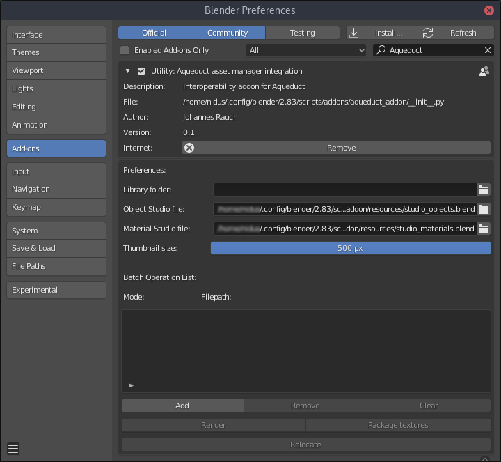
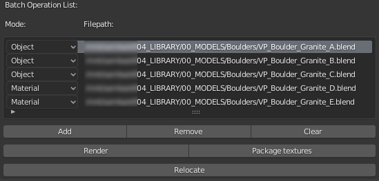

########################
Global Addon Preferences
########################

Aqueduct's Addon Preferences contain a few settings that are used for thumbnail
preview generation and the Batch Operation List. The Batch operation list enables
you to execute some of Aqueducts operators and features on a huge amount of files.

***********
Preferences
***********

Library folder
    The path to your library folder can be set here. All file export dialogues will
    then open with this path as the default the first time you export something.
    You can set the folder path by clicking on the **Folder Icon on the right**.

Object Studio file
    The blendfile that gets used as a studio when rendering objects and collections.
    The Aqueduct addon ships with a simple default studio file, but you can create
    your own studio file and change the path here by clicking on the **Folder Icon
    on the right**.

    .. hint::
        When you create your own object studio file the only requirement is that
        there is a Camera object already in the file and that this Camera is set
        as the **Scene Camera** in the **Scene Properties Panel**.

        .. image:: ./_static/images/bl_gui_props_scene_camera.png

Material Studio file
    The blendfile that gets used as a studio when rendering materials. The 
    Aqueduct addon ships with a default material studio file, but you can
    create your own studio file and change the path here by clicking on the
    **Folder Icon on the right**.

    .. hint::
        When you create your own material studio file there are multiple requirements.

        * The file needs to contain a camera that is set as **Scene Camera** just
          like for the object studio files. 
        * The **objects that will be used to preview your material** (I.e your 
          material gets applied to) **must have MATGEO in their name** (e.g MATGEO_Shaderball). 

        You can always look at the material
        studio file that ships with Aqueduct to get a better understanding of how
        it is constructed.

Thumbnail size
    The size of the rendered preview thumbnail PNG-files that Aqueduct creates
    when you export an asset and the render preview thumbnail option. The slider
    goes from 150px to 500px and defaults to 500px.

********************
Batch Operation List
********************
You can to use the Batch Operation List when you want to use one of Aqueducts
features on a huge number of files. Currently Rendering of preview images, 
packaging of all used textures in a file and relocating of a file together with
its preview image and its textures is supported.

.. hint::
   When you export an Asset and don't tick the checkbox to render a preview 
   thumbnail image, Aqueduct automatically adds that file to the Batch Operation
   List, so you can render your thumbnails later.

Add
    Opens a file browser that lets you add multiple blend files to the list

Remove
    Removes the currently selected listentry from the batch operation list

Clear
    Clears the batch operation list

Render
    Creates preview thumbnail images for all files in the batch list.
    The **Mode** entry of each listitem decides which studio file will
    be used.

Package textures
    Packages and relinks all textures for all files in the list. All gathered
    textures will be copied to a texture folder right next to the blend file.

Relocate
    Relocates all assets in the list and the files associated with it. It will
    move the blendfile, package its textures and copies them to the new location
    in a texture folder. If there are already existing thumbnail preview images
    they will be moved as well.
