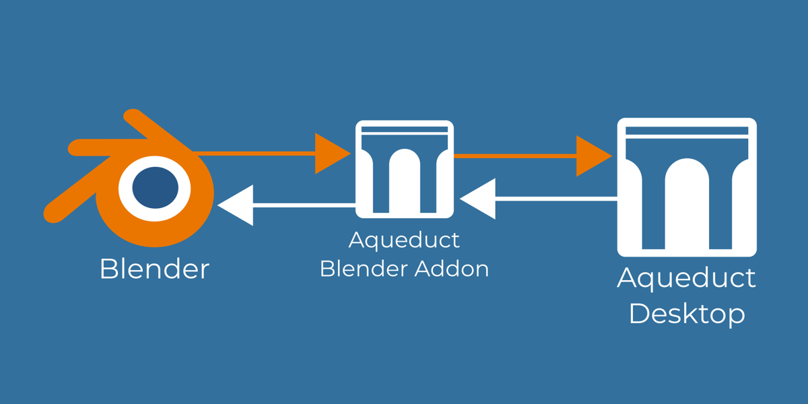

Welcome to Aqueduct's documentation!
=====================================

.. raw:: html

    

        <iframe width="1080" height="667" src="https://www.youtube.com/embed/nV353pijQUo" frameborder="0" allowfullscreen></iframe>
    

.. .. image:: ./_static/images/aqueduct_splash.png
..    :width: 600

About Aqueduct
--------------

Aqueduct is a blender addon that strives to make the appending/linking and saving
of 3D assets to an Asset Library fast and comfortable. It features a custom context
menu (shown below) for when you drop .blend-files  on the viewport and the ability
to save Materials, Objects and Collections to their own files and render preview
thumbnails automatically.

Aqueducts goal is to enable the usage of an external 3D Asset and Material library
Manager in conjunction with blender. Alternatively you can simply use your systems
file browser to manage your assets and drag and drop them onto blender.

The Aqueduct project features a standalone open source C++ 3D Asset and Material
library manager Desktop app. Currently the Aqueduct Asset Manager is in Alpha
stage but hopefully will be stable and feature complete enough for its first
release soon.

.. toctree::
   :maxdepth: 2
   :caption: Contents:

   getting_started 
   drag_drop
   pie_menu
   global_preferences
