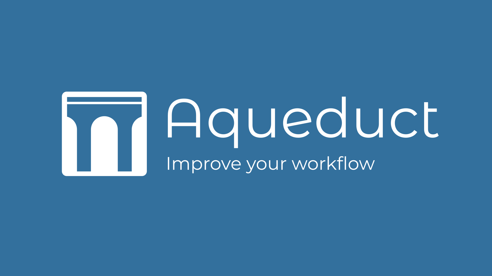

Welcome to Aqueducts documentation!
=====================================

Aqueduct is a blender addon that strives to make the appending/linking and saving
of 3D assets to an Asset Library fast and comfortable. It features a custom context
menu (shown below) for when you drop .blend-files  on the viewport and the ability
to save Materials, Objects and Collections to their own files and render preview
thumbnails automatically.

.. image:: ./_static/images/bl_gui_ddmenu.png

**A video showing the most important features can be found here:**

.. toctree::
   :maxdepth: 2
   :caption: Contents:

   getting_started 
   pie_menu
   global_preferences
