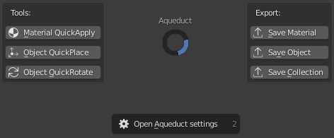

#####################
The Aqueduct Pie Menu
#####################

**********************
Accessing the Pie Menu
**********************

You can open the Aqueduct Pie Menu by pressing **Hotkey: Ctrl + Shift + A**

.. tip::
    if you want to rebind the hotkey for the Pie Menu you can do so by opening
    **Blenders preferences** and navigation to the **Keymap Section** and searching
    for the **Aqueduct Keybind**.
    
    **Edit >> Preferences... >> Keymap >> Search "Aqueduct"**

    If you want to add additional bindings for the Aqueduct Pie Menu you can do so by creating a new Keymap entry with the following values:

    =============== ======================
    Slot            Value
    =============== ======================
    **Identifier:** wm.call_menu_pie
    **Name:**       VIEW3D_MT_PIE_Aqueduct
    =============== ======================
 

*********
Operators
*********

Tools
=====

Material QuickApply Operator
----------------------------
**Hotkey: Ctrl + Shift + Q**

Material QuickApply mode changes your cursor to a color picker,waits
for you to leftclick on a mesh in the viewport and picks up the material.
Then you can leftclick on other meshes in the Viewport to apply the material
to them. A normal leftclick will apply the material to the slot which faces
you clicked while a **Shift + LMouse-click** will apply it to all material
slots.

============== ==========================================================
Hotkey         Description
============== ==========================================================
LMouse         Apply the material to the slot the clicked face belongs to
Shift + LMouse Apply the material to all material slots
RMouse/Esc     Cancel
============== ==========================================================

Object Quickplace Operator
--------------------------
Expects:
    Single object or multiple objects selected in the 3D Viewport

**Hotkey: Ctrl + Shift + W**

Quickplace lets you move objects along the X, Y, Z world axis which you can
toggle by pressing **Hotkey: W** once the operator is active. The mouse 
wheel lets you adjust how much random offset is added to each individual
object.

============== ==========================================================
Hotkey         Description
============== ==========================================================
LMouse         Apply the previewed transform to all objects
W              Toggle transform axis (World X, Y, Z)
MWheel-Up/Down Adjust the amount of random offset
RMouse/Esc     Cancel the transform
============== ==========================================================

Object QuickRotate Operator
---------------------------
Expects:
    Single object or multiple objects selected in the 3D Viewport

**Hotkey: Ctrl + Shift + E**

QuickRotate lets you rotate objects along the X, Y, Z local axis of each
object, you can toggle the axis by pressing **Hotkey: E**. The mosue wheel
lets you adjust how much random rotation offset is added to each individual
object.

============== ==========================================================
Hotkey         Description
============== ==========================================================
LMouse         Apply the previewed rotation to all objects
E              Toggle rotation axis (World X, Y, Z)
MWheel-Up/Down Adjust the amount of random offset
RMouse/Esc     Cancel the transform
============== ==========================================================

Export
======

Save Material Operator
----------------------
Expects:
    An object to be selected in the 3D Viewport or Outliner

Shows:
    This file export dialog where you can set the path the material will get saved to.
    The dialogs default folder will be your **Library Folder** which can be set in the
    Global Addon Preferences. The dialog also has a sidebar with multiple export options.

    .. image:: ./_static/images/bl_gui_fileview_material.png
       :width: 600

Options
^^^^^^^
Resources to export:
    Lists all Materials on the selected objects. You can uncheck Materials you
    don't want to export

Render thumbnail:
    Renders a preview thumbnail using the Material Studio blendfile (can be 
    changed in the Global Addon Preferences)

Package and relink textures:
    Gathers all textures used by the resources and copies them in a textures folder
    right next to the blendfile

Each asset in its own file:
    Will save each selected Material in the Resources to export list to its own
    blendfile and render a thumbnail for each if the option is checked

Save Object Operator
--------------------
Expects:
    One or more objects to be selected in the 3D Viewport or Outliner

Shows:
    This file export dialog where you can set the path the objects will get saved to.
    The dialogs default folder will be your **Library Folder** which can be set in the
    Global Addon Preferences. The dialog also has a sidebar with multiple export options.

Options
^^^^^^^
Resources to export:
    Lists all selected objects. You can uncheck objects you don't want to export

Render thumbnail:
    Renders a preview thumbnail using the **Object Studio blendfile** (can be 
    changed in the **Global Addon Preferences**)

Package and relink textures:
    Gathers all textures used by the resources and copies them in a textures folder
    right next to the blendfile

Each asset in its own file:
    Will save each selected object in the "Resources to export" list to its own
    blendfile and render a thumbnail for each if the option is checked

Pivot Placement:
    Where the object pivot will be placed that will be used to center the object
    or the group of objects to be saved (Default -Z | Bottom).

Save Collection Operator
------------------------
Expects:
    One or more objects to be selected in the 3D Viewport or Outliner.
    The operator will walk up the hierarchy tree and get the collections the objects are
    in there is no need to select collections in the Outliner.

Shows:
    This file export dialog where you can set the path the collections will get saved to.
    The dialogs default folder will be your **Library Folder** which can be set in the
    Global Addon Preferences. The dialog also has a sidebar with multiple export options.

Options
^^^^^^^
Resources to export:
    Lists all Collections the selected objects are in. You can uncheck collections
    you don't want to export.

Render thumbnail:
    Renders a preview thumbnail using the **Object Studio blendfile** (can be 
    changed in the **Global Addon Preferences**)

Package and relink textures:
    Gathers all textures used by the resources and copies them in a textures folder
    right next to the blendfile

Each asset in its own file:
    Will save each selected collection in the "Resources to export" list to its own
    blendfile and render a thumbnail for each if the option is checked

Pivot Placement:
    Where the object pivot will be placed that will be used to center the collection
    or the group of collections to be saved (Default -Z | Bottom).

Other
=====

Open Aqueduct settings
----------------------
Opens the Blender Preferences window on the Addon-Tab and filters addons to only
display the Aqueduct Addon for a fast access to Aqueduct's settings.

A detailed description of Aqueducts settings can be found in **Global Addon Preferences**.

.. image:: ./_static/images/bl_gui_prefs_aqueduct.png
   :width: 600
